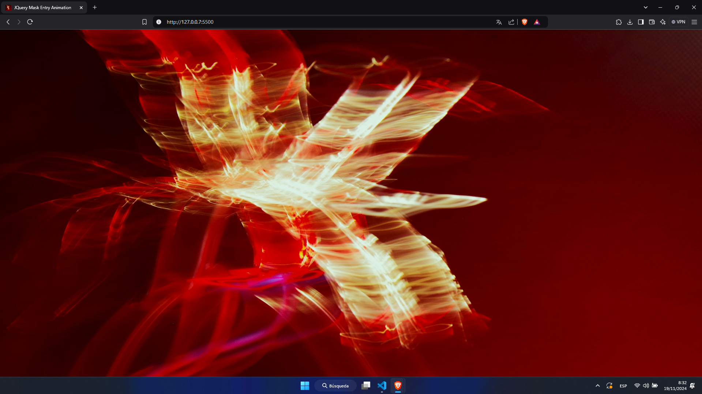

# JQuery Mask Entry Animation
 
Implementation of an intro animation with clip-path mask for images using jQuery and jQuery UI, inspired by the [Olivier Larose blog](https://blog.olivierlarose.com/tutorials/mask-entry).

Read blog post: []()

Live demo: [CodePen/cpadlab](https://codepen.io/cpadlab/pen/oNKJwqN)

## Requirements

- [jQuery](https://jquery.com/) (version 3.x or higher)
- [jQuery UI](https://jqueryui.com/) (for animations)
  
You can add these files to your project by downloading them from their respective websites or by including the links through a CDN, they are included in the repository.

## Install

```bash
git clone https://github.com/cpadlab/JQuery-Mask-Entry-Animation
cd JQuery-Mask-Entry-Animation && ./index.html
```

## Gallery

